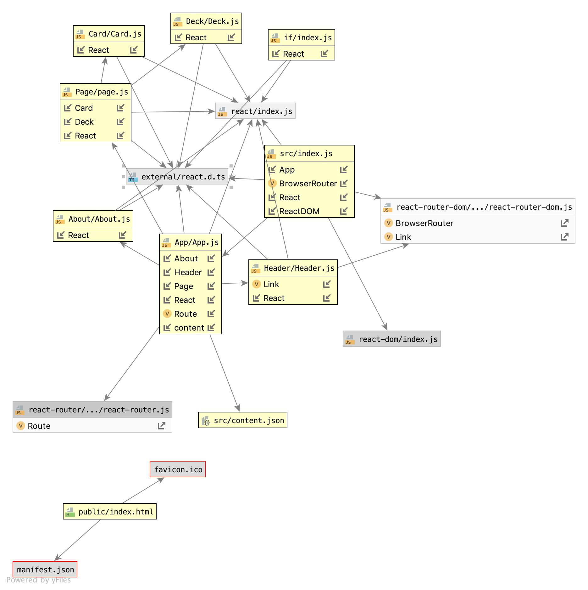

# LAB - 28

## React State

### Author: Jessica Walters

### Links and Resources
* [submission PR](https://github.com/401-advanced-javascript-jessica/401-lab-29-practice/pull/2)
* [travis](https://www.travis-ci.com/401-advanced-javascript-jessica/401-lab-29-practice)
* [Amplify](https://master.d37a4s7lxb23b2.amplifyapp.com/)

#### Documentation
* [styleguide](localhost:6060)

### Components
#### `About.js`
#### `App.js`
#### `Card.js`
#### `Deck.js`
#### `Header.js`
#### `If.js`
#### `Page.js`

### Setup

#### Running the app
* `npm run start`
  
#### Tests
* `npm run test`

#### UML

